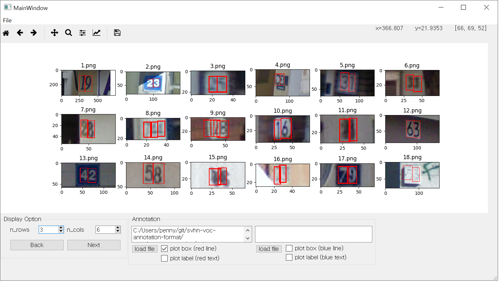
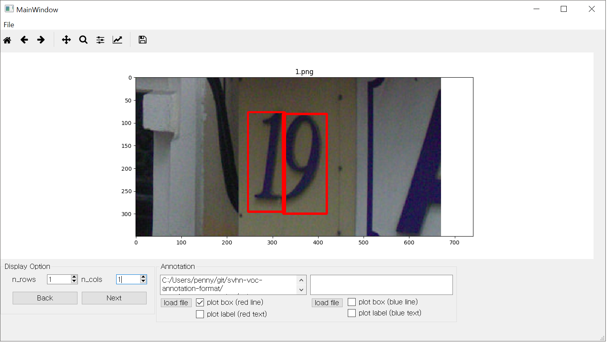

# SVHN Voc Annotation Format

This project provides the svhn dataset in [PASCAL VOC Annotation Format](http://host.robots.ox.ac.uk/pascal/VOC/voc2007/) and 
simple viewer tool to confirm annotation.

## How to use

#### 1. Download SVHN images

Download the train and test set for Format1 from [SVHN dataset](http://ufldl.stanford.edu/housenumbers/).

#### 2. Clone this Project

Clone this project and check annotation file in xml format for train and test set in annotation directory.

#### 3. Confirm Annotation

This project provides a simple image tool to check annotation.

Run [view.py](https://github.com/penny4860/svhn-voc-annotation-format/blob/master/view.py) and load image directory and annotation directory, respectively. You can see the annotation result as follows.

You can also check multiple images at once by the display option.

